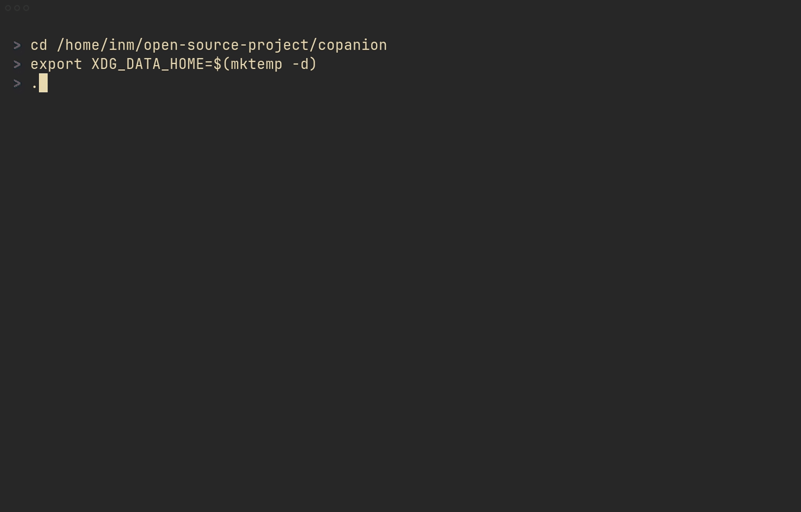

# copanion: TUI for Code Study

Study a codebase in your terminal, keep notes on exact lines, and export only the questions you still want help answering.



## Why I built this

When I study an unfamiliar codebase, I struggle with the constant back-and-forth between the source and a separate explanation. A card-style companion for guidance and notes, anchored directly to the code, makes the learning flow much easier to hold onto.

Asking follow-up questions has the same problem. By the time I want help from an agent, I still have to gather the exact source location and package the right context. `copanion` removes that busywork: keep notes beside the code while you read, then export the open questions with their context when you are ready to ask.

## Overview

`copanion` is a Rust CLI/TUI for persistent source-learning sessions.

It opens tracked files in a terminal UI, injects note cards directly below the lines they explain, and lets you stage follow-up questions in place. Notes stay local. Only open questions are exported back to the clipboard or stdout.

Sessions are stored under the user data directory, usually `~/.local/share/copanion/sessions/`. The default session id is deterministic for the current directory, so reopening the same repo brings you back to the same study session unless you choose a different name with `--session`.

If a session has no tracked files yet, `copanion` opens directly into the fuzzy file picker so you can start from inside the TUI.

## Features

- **Inline notes and questions** - Attach notes or follow-up questions to exact lines or selected ranges.
- **Persistent sessions** - Save and reopen the same study session across runs.
- **Fuzzy file picker** - Add tracked files from inside the TUI instead of preparing them up front.
- **Searchable annotations** - Jump through saved notes and questions with a fuzzy search prompt.
- **Question-only export** - Keep notes local and export only unresolved questions.
- **Clipboard or stdout output** - Copy exports to the clipboard by default, or print them with `--stdout`.
- **Deterministic session paths** - Use the default per-directory session id or a stable named session with `--session`.
- **Built-in themes** - Pick a theme from the CLI or config file.

## Installation

### From crates.io

```bash
cargo install copanion
```

### From source

```bash
git clone https://github.com/inmzhang/copanion.git
cd copanion
cargo install --path .
```

## Usage

Run `copanion` in the repository you want to study:

```bash
cd /path/to/your/repo
copanion
```

That opens the default session for the current directory. If the session is empty, `copanion` starts in the fuzzy file picker.

### Options

| Flag | Description |
|------|-------------|
| `-s`, `--session <SESSION>` | Stable session name. Defaults to a deterministic id derived from the current directory. |
| `--title <TITLE>` | Title to use when creating or reopening a session. |
| `--fresh` | Recreate the saved session while preserving tracked files when no new files are supplied. |
| `--print-session-path` | Print the saved session path and exit. |
| `--export` | Export open questions without opening the TUI. |
| `--stdout` | Print exports to stdout instead of copying them to the clipboard. |
| `--theme <THEME>` | Built-in UI theme: `dark`, `light`, `one-dark`, `gruvbox-dark`, `gruvbox-light`, `catppuccin-mocha`, `catppuccin-latte`, `ayu-light`. |
| `<FILE>...` | Attach one or more files to the current session before opening the TUI. |

Examples:

```bash
copanion --session scheduler-tour src/main.rs src/lib.rs
copanion --session scheduler-tour --print-session-path
copanion --session scheduler-tour --export --stdout
copanion --session scheduler-tour --theme gruvbox-dark
```

## Configuration

Set a default theme in:

- Linux/macOS: `$XDG_CONFIG_HOME/copanion/config.toml` (default: `~/.config/copanion/config.toml`)
- Windows: `%APPDATA%\copanion\config.toml`

Example:

```toml
theme = "gruvbox-dark"
```

Theme resolution precedence:

1. `--theme <THEME>`
2. `theme` in the config file above
3. built-in default (`gruvbox-dark`)

Only `theme` is currently recognized. Unknown keys are ignored with a startup warning.

## Keybindings

### Navigation

| Key | Action |
|-----|--------|
| `Tab` | Toggle focus between the file list and source view |
| `j` / `k` | Move in the focused pane |
| `h` / `l` | Switch files from the source pane |
| `g` / `G` | Jump to the first or last line |
| `[` / `]` | Jump to the previous or next annotated line |
| `PageUp` / `PageDown` | Scroll by page |
| `?` | Toggle help |

### Notes And Questions

| Key | Action |
|-----|--------|
| `v` / `V` | Start a visual selection for a ranged note or question |
| `a` | Create a `QUESTION` draft at the cursor or selected range |
| `n` | Create a `NOTE` draft at the cursor or selected range |
| `i` | Edit the question under the cursor, or fall back to the note |
| `I` | Edit the note under the cursor, or fall back to the question |
| `/` | Fuzzy-search notes and questions, then jump to the selected match |
| `dd` | Delete the selected tracked file or the annotation under the cursor |
| `Ctrl-o` | Open the current draft in `$VISUAL` or `$EDITOR` |
| `Ctrl-s` | Save the current draft from inside the prompt window |
| `Esc` | Leave visual mode or close the current popup |

### Session Actions

| Key | Action |
|-----|--------|
| `f` | Open the fuzzy file picker and add a tracked file |
| `r` | Reload tracked file contents from disk |
| `s` | Save the session |
| `y` | Export open questions without quitting |
| `x` | Save, export open questions, and quit |
| `q` | Quit, with a discard guard if there are unsaved changes |
